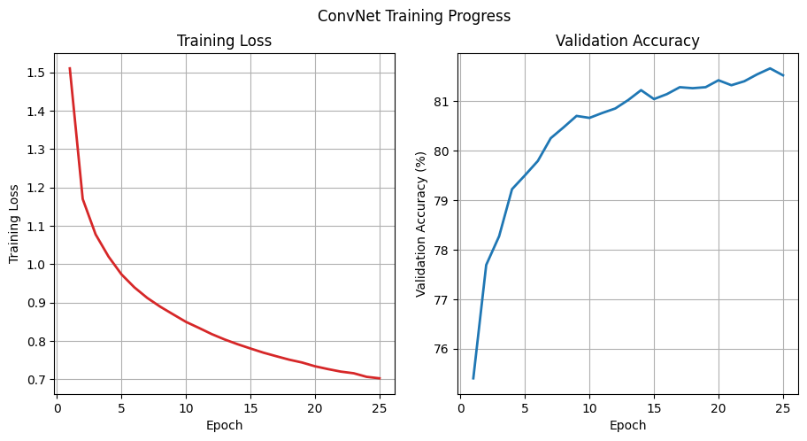

# Doodle Recognition

By: Arjun Phanse

## Overview
In this project, I researched how well computer vision models (ConvNet, ResNet18, DINOv2) would be able to identify doodle images from Google's [Quick Draw](https://github.com/googlecreativelab/quickdraw-dataset?tab=readme-ov-file) dataset. Users can draw doodles, and receive the top five predicted classifications from each of the models.

## Demo

https://github.com/user-attachments/assets/d7620404-5420-46d9-96c9-f3fe4b1f482b

## Setup
First, download the data 50 classes from the Quick Draw dataset.

## Training

The Quick Draw dataset consists of over 50 million drawings over 345 categories. I selected 50 classes and used the provided 28x28 bitmap format. 

### ConvNet

For [ConvNet](https://proceedings.neurips.cc/paper_files/paper/2012/file/c399862d3b9d6b76c8436e924a68c45b-Paper.pdf), I followed a [PyTorch tutorial](https://github.com/pytorch/examples/blob/main/mnist/main.py), and trained ConvNet on the [MNIST](https://huggingface.co/datasets/ylecun/mnist) dataset. Because the images in the MNIST and Quick Draw dataset were 28x28, I was able to adapt the code from the PyTorch tutorial, and successfully adapt it to training a ConvNet on the Quick Draw dataset. 

### Resnet

## Evaluation Results

