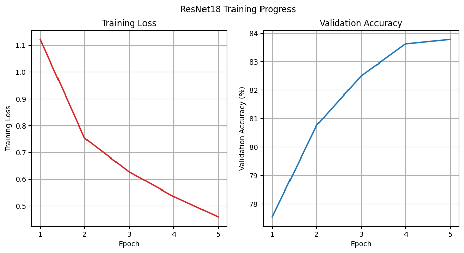
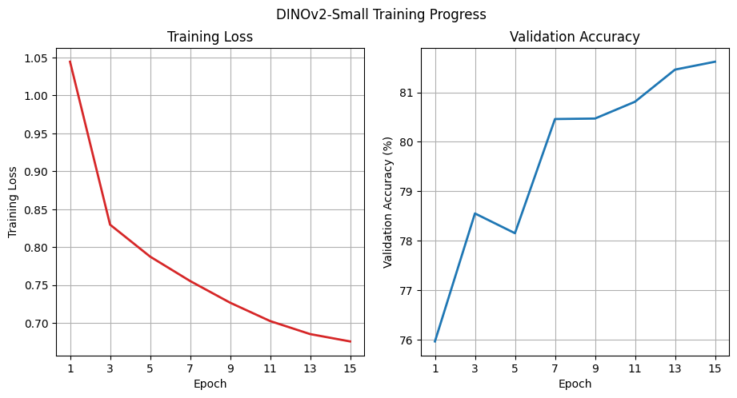

# Doodle Recognition

By: Arjun Phanse

## Overview
In this project, I researched the ability of computer vision models (ConvNet, ResNet18, DINOv2-Small) to identify doodle images from Google's Quick Draw dataset. I built an application to allow users to draw doodles and receive predicted classifications from each of the models I trained.

## Demo


## Training

The [Quick Draw](https://github.com/googlecreativelab/quickdraw-dataset?tab=readme-ov-file) dataset consists of 50+ million drawings over 345 categories. I trained computer vision models using the provided 28x28 bitmaps of doodles across 50 classes from the dataset.

### ConvNet

A Convolutional Neural Network (CNN) is a deep learning model that identifies features in images using learned convolutional filters and then makes predictions based on those features. First, I learned how to train a ConvNet on the [MNIST](https://huggingface.co/datasets/ylecun/mnist) dataset by following this [PyTorch tutorial](https://github.com/pytorch/examples/blob/main/mnist/main.py). Because the images in the MNIST and Quick Draw dataset were 28 by 28 pixels, I was able to use the same code from the PyTorch tutorial, and successfully adapt it to training a ConvNet on the Quick Draw dataset. 

**Hyperparameters for Convnet (QuickDraw) and Convnet (MNIST):**

| Setting | Convnet (QuickDraw) | Convnet (MNIST) |
|---|---|---|
| Training samples per class | $8000$ | All |
| Epochs | $25$ | $14$ |
| Batch size | $128$ | $64$ |
| Learning rate | $10^{-3}$ | $1$ |
| Scheduler | [StepLR](https://docs.pytorch.org/docs/stable/generated/torch.optim.lr_scheduler.StepLR.html) (gamma = 0.95) | StepLR (gamma = 0.7) |
| Optimizer | AdamW | AdaDelta |
| Weight decay | $10^{-4}$ | N/A |
| Input size | $28 \times 28$ | $28 \times 28$ |

---

The main changes that I made to the PyTorch tutorial hyperparameters were increasing the number of epochs, decreasing the learning rate from 1 to 0.001, and using the AdamW optimizer.


I evaluated the trained ConvNet on a test set containing 1500 drawings per class. The test loss was 0.7468 and the test accuracy was 81.12%.

### ResNet18
A [Residual Neural Network (ResNet)](https://arxiv.org/abs/1512.03385) is a deep CNN that employs skip connections to address the vanishing gradient problem when training deeper neural networks.

**Hyperparameters for ResNet18:**

| Setting | Value |
|---|---|
| Training samples per class | $8000$ |
| Epochs | $5$ |
| Batch size | $64$ |
| Learning rate | $10^{-3}$ |
| Scheduler | StepLR (gamma = 0.7) |
| Optimizer | AdamW |
| Weight decay | $10^{-4}$ |
| Input size | $28×28$|
---

I was able to achieve a high accuracy on ResNet18 by reducing the number of epochs to prevent overfitting on the training data.



I evaluated the trained ResNet18 model on a test set containing 1500 drawings per class. The test loss was 0.6353 and the test accuracy was 83.62%.


### DINOv2-Small

DINOv2 is a vision transformer model that consists of a pretrained backbone and a trained classification head. In this project, I used [DinoV2-Small](https://huggingface.co/facebook/dinov2-small), which is based on the [ViT-Small/14](https://arxiv.org/abs/2010.11929) architecture

**Hyperparameters for DINOv2-Small:**

| Setting | Value |
|---|---|
| Training samples per class | $4000$ |
| Epochs | $15$ |
| Batch size | $64$ |
| Learning rate | $10^{-3}$ |
| Scheduler | [CosineAnnealingLR](https://docs.pytorch.org/docs/stable/generated/torch.optim.lr_scheduler.CosineAnnealingLR.html) (T_max = 15) |
| Optimizer | AdamW |
| Weight decay | $10^{-4}$ |
| Input size | $224×224$ |

The DINOv2-Small backbone was trained on 224x224 images. As a result, it was necessary to upsample the 28x28 drawings by a factor of 8.



I evaluated the trained DINOv2-Small model on a test set containing 750 drawings per class. The test loss was 0.7407 and the test accuracy was 81.39%.

## App

I created a demo application, which hosts the models I trained and runs them on user-created drawings. First, the app loads the trained models. Next, users can draw doodles from the list of classes. Once the user is done drawing, they receive classification predictions from each of the three models. Refer back to the demo video to see the app.

## Run

Here are the instructions to run all of the scripts for this project.

```sh
# Download data from 50 classes in the QuickDraw dataset (~5GB)
bash download_quickdraw.sh

# Run ConvNet (MNIST) training and evaluation
python3 convnet.py

# Run ConvNet (Quick Draw) training and evaluation
python3 convnet_quickdraw.py --samples-per-class 10000 --save-model

# Run ResNet18 (Quick Draw) training and evaluation
python3 resnet_quickdraw.py --samples-per-class 10000 --epochs 5 --save-model

# Run DINOv2-Small (Quick Draw) classification head training and evaluation
python dinov2_head_quickdraw.py --samples-per-class 5000 --epochs 15 --save-model

# Run Flask drawing app
export FLASK_APP=app.py
python3 -m flask run
```

## Conclusion

Overall, I learned how to train the ConvNet, Resnet18, and DINOV2-Small models. As next steps, I would use more training data from the QuickDraw dataset to further improve accuracy. Additionally, I would use more classes from the QuickDraw dataset to support classification of more types of doodles. Thanks for reading my project!


